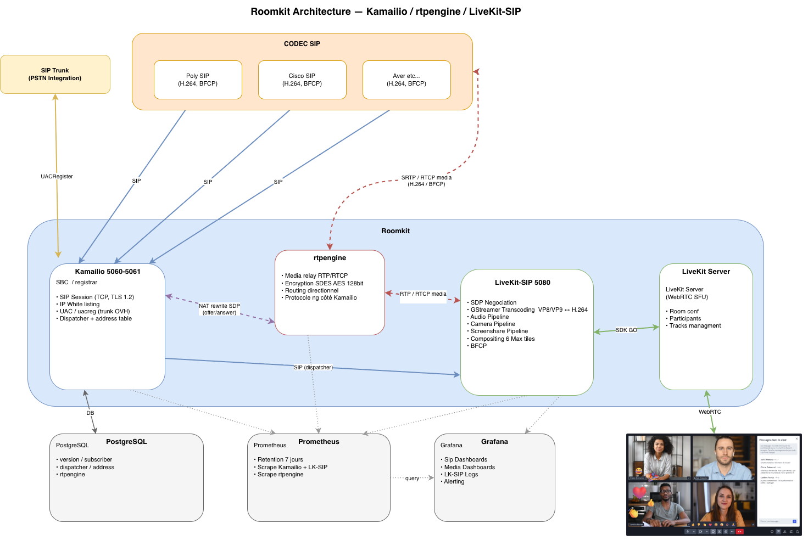

# Architecture

`${MY_IP_ADDR}` is the host's LAN IP, written to `.env` by `make env`.



## Components

### Kamailio (SIP proxy & dispatcher)

- Receives SIP from external endpoints and dispatches to `livekit-sip:5080` over the dispatcher table.
- Handles UAC registration for the OVH SIP trunk (inbound DIDs).
- Drives SDP rewrites via rtpengine during offer/answer for NAT traversal.
- Reads subscriber, dispatcher, address, rtpengine, and uacreg rows from PostgreSQL.
- IP whitelist enforced via the `permissions` module + `address` table.

### rtpengine (media & control relay)

- Forwards RTP (media) and RTCP (control) between SIP endpoints and livekit-sip.
- Applies SDES (AES-128) for SRTP / SRTCP on the SIP leg.
- Directional routing, keeps NAT bindings alive.
- Talks to Kamailio over the `ng` UDP protocol on `${MY_IP_ADDR}:22222`.

### livekit-sip (translation, transcoding, media management)

- SIP listener on port 5080 (UDP + TCP). SDP negotiation and BFCP for screen sharing.
- Audio: transcodes G.711 (PCMU/PCMA) and G.722 to Opus; active speaker detection; bidirectional audio track management.
- Video: GStreamer pipelines transcode H.264 ↔ VP8/VP9; manages camera and screenshare pipelines.
- RTCP feedback bridging: translates SIP RTCP into WebRTC control (PLI for keyframe recovery, FIR for full intra requests, NACK), and vice versa. Keeps audio/video lip-sync.
- Composites up to 6 tiles on the return video sent back to the SIP endpoint.
- Publishes transcoded audio + video as WebRTC tracks into the LiveKit SFU via the Go SDK.

## External systems

- **SIP endpoints** — Cisco, Poly, Aver and other compatible SIP devices on the LAN.
- **OVH SIP trunk** — PSTN inbound via the `uacreg` registration row.
- **LiveKit Server (WebRTC SFU)** — terminates the LiveKit side; rooms, participants, audio/video tracks. Roomkit reaches it as `ws://localhost:7880`.
- **PostgreSQL** — stores Kamailio runtime state (`version`, `subscriber`, `dispatcher`, `address`, `rtpengine`, `uacreg`).

## Observability stack (`make start-all`)

- **Prometheus** — scrapes Kamailio, livekit-sip, rtpengine (7-day retention).
- **Grafana** — SIP dashboards, media dashboards (packet loss, jitter, RTCP), livekit-sip logs, alerting.
- **Loki + Promtail** — log shipping for all containers.
- **Exporters** — `kamailio-exporter` (BINRPC → :9103), `rtpengine-exporter` (NG → :9102).

## Container topology

```
┌─────────────────────── HOST  ${MY_IP_ADDR}  ───────────────────────────────┐
│                                                                            │
│  meet compose                                                              │
│    ├─ livekit         publishes :7880 ws / :7881 / :7882 udp               │
│    ├─ livekit-egress                                                       │
│    ├─ redis           publishes :16379 → 6379                              │
│    ├─ postgresql      publishes :15432 → 5432                              │
│    └─ app-dev / frontend / keycloak / minio / nginx / mailcatcher          │
│                                                                            │
│  roomkit-visio compose                                                     │
│    ├─ postgres-kamailio (bridge) publishes :25432 → 5432                   │
│    ├─ kamailio          (host)   binds :5060/udp+tcp, :5061/tcp, :2049/tcp │
│    ├─ rtpengine         (host)   binds :22222/udp + RTP range              │
│    ├─ livekit-sip       (host)   binds :5080/udp+tcp + :9101 (prom)        │
│    ├─ prometheus        (host)   binds :9190                               │
│    ├─ grafana           (host)   binds :3001                               │
│    ├─ loki              (host)   binds :3100                               │
│    ├─ promtail          (host)   reads docker logs                         │
│    ├─ rtpengine-exporter(host)   binds :9102                               │
│    └─ kamailio-exporter (host)   binds :9103                               │
│                                                                            │
│  Inter-service traffic uses localhost (all on the host network):           │
│    kamailio    → postgres        localhost:25432                           │
│    kamailio    → rtpengine       udp:${MY_IP_ADDR}:22222 (DB-driven)       │
│    kamailio    → livekit-sip     sip:${MY_IP_ADDR}:5080 (DB-driven)        │
│    livekit-sip → meet livekit    ws://localhost:7880                       │
│    livekit-sip → meet redis      localhost:16379                           │
└────────────────────────────────────────────────────────────────────────────┘
```

## System flows

### SIP signaling

1. SIP endpoints or the OVH trunk send SIP to Kamailio (`${MY_IP_ADDR}:5060`).
2. Kamailio looks up subscriber and dispatcher rules in PostgreSQL.
3. Kamailio calls rtpengine over `ng` to rewrite the SDP offer/answer for NAT.
4. Kamailio forwards the modified INVITE to `sip:${MY_IP_ADDR}:5080;transport=tcp` (livekit-sip).
5. livekit-sip finalises SDP negotiation (codecs + SDES keys) and joins the LiveKit room.

### Media & control (audio, video, screenshare, RTCP)

1. SIP endpoints send RTP/SRTP (audio in G.711/G.722, video in H.264, screenshare via BFCP) to rtpengine.
2. RTCP/SRTCP flows bidirectionally for stream health, lip-sync, and packet-loss reporting.
3. rtpengine relays both media and control to livekit-sip (`${MY_IP_ADDR}:30001-30100/udp`).
4. livekit-sip GStreamer pipelines:
   - **RTCP**: on packet loss, emits PLI / FIR back to the SIP endpoint to force a keyframe.
   - **Audio**: separates, transcodes to Opus, hands off to WebRTC.
   - **Video**: transcodes H.264 → VP8/VP9; manages camera and screenshare pipelines.
5. livekit-sip publishes the transcoded audio + video as WebRTC tracks into the LiveKit SFU.
6. SIP participants appear as WebRTC users in the LiveKit room.
